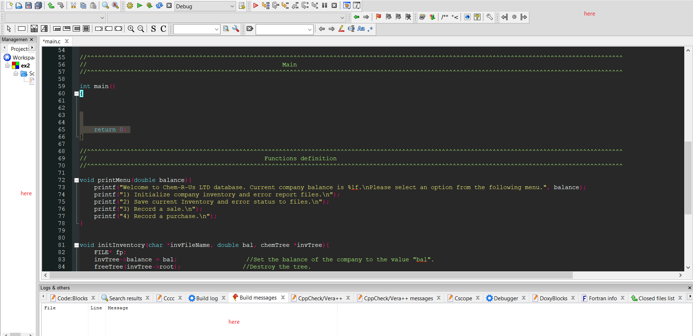

## CodeBlocks Color Theme

This is a custom color theme for the CodeBlocks IDE. It is a dark theme with a focus on readability and eyestrain reduction.

## Installation

1. Download the `theme.conf` file from this repository.
2. Open CodeBlocks and go to `Settings` > `Editor` > `Syntax Highlighting`.
3. Click the `Import` button and select the `theme.conf` file you downloaded.
4. Select the `Theme` you want to use from the drop-down list.

## Usage

The theme is ready to use once you have installed it. You can customize the theme by editing the `theme.conf` file.

## Screenshots

Here are some screenshots of the theme in action:

## License

This theme is released under the MIT license.

## Contributing

If you would like to contribute to this theme, please feel free to fork this repository and create a pull request.

